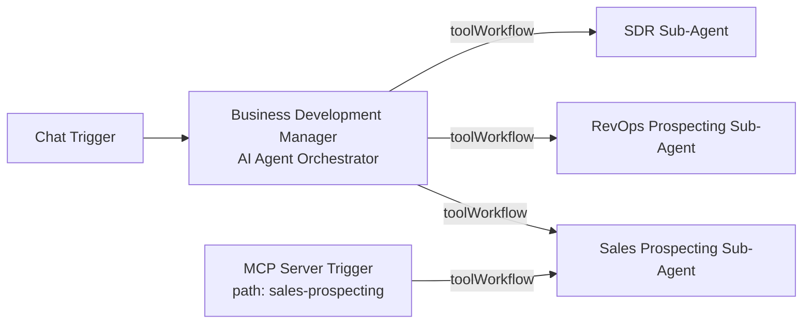

# n8n Agentic Workflow Blueprints

A collection of **n8n workflow JSON exports** covering multi-agent sales automation patterns, MCP tool exposure, personal AI assistants, and foundational n8n tutorials.

These are importable blueprints and learning scaffolds—not a packaged application. Most workflows define triggers, LangChain agents, and system prompts; you must attach credentials, language models, and any external tools before they run end-to-end.

## What this repo is for

| Audience | Use case |
| --- | --- |
| n8n builders | Reference patterns for agent orchestration, sub-workflows, and MCP |
| Learners | Starter workflows for chatbots, Gmail/Slack/Telegram, Drive, and forms |
| Portfolio / demos | Starting points for sales BD agents and personal productivity assistants |

## Key features

- **Multi-agent business development pattern** — A chat-triggered orchestrator that calls specialized sub-agents via `toolWorkflow` nodes (prospecting, RevOps structuring, SDR outreach)
- **MCP server blueprint** — Exposes the sales prospecting sub-agent through n8n’s MCP Server Trigger (`/sales-prospecting`)
- **Account executive sub-agents** — Demo booking and deal recording agents with OpenAI (`gpt-4o-mini`) wired in
- **Drive automation stubs** — Folder watch → Slack notification; folder watch → PDF text extraction
- **Personal AI experiments** — Chat/webhook/schedule agents for portfolio, email drafting, Slack/Telegram, Gemini, and voice-oriented entry points
- **Masterclass & foundations** — Minimal tutorials for JSON, HTTP requests, Gmail, forms, and basic agents

## Architecture overview

### Amplify business development orchestrator



The orchestrator (`amplify/business-development/business_development_manager.json`) receives chat input and can delegate to three sub-workflows. The MCP workflow reuses the same prospecting sub-agent as a tool for MCP clients.

**Important:** `toolWorkflow` nodes reference workflow IDs from the instance they were exported from. After import, re-select each sub-workflow in n8n so IDs match your instance.

### Account executive pattern

Sub-agents under `amplify/account-executive/` use `executeWorkflowTrigger` so a parent workflow can call them. Each includes an OpenAI Chat Model node (`gpt-4o-mini`) and an agent with a role-specific system message (demo booking / deal recording). Calendar and CRM integrations mentioned in the prompts are not wired as nodes yet.

## Tech stack

| Layer | Technology |
| --- | --- |
| Runtime | [n8n](https://n8n.io/) (workflow engine) |
| AI agents | `@n8n/n8n-nodes-langchain` (Agent, Chat Trigger, MCP Trigger, toolWorkflow) |
| Models (where wired) | OpenAI (`gpt-4o-mini`), Google Gemini (`models/gemini-1.5-pro`) |
| Integrations used in nodes | Slack, Telegram, Gmail, Google Drive, Google Sheets, n8n Form, Webhook, HTTP Request, Schedule |
| Format | n8n workflow JSON exports |

There is no application server, database, or package.json in this repository—only workflow definitions and git metadata.

## Project structure

```
n8n-workflows/
├── amplify/                          # Sales / BD-oriented blueprints
│   ├── account-executive/            # Demo booking & deal recording sub-agents
│   ├── automation-workflows/         # Drive watchers & web-search agent
│   ├── business-development/         # Orchestrator + RevOps/SDR sub-agents
│   └── mcp/                          # MCP server + prospecting sub-agent
└── personal/
    ├── ai-builder/                   # Personal AI assistant experiments
    └── n8n-masterclass/
        ├── agentic-ai/               # Gmail / Calendar / Telegram agents
        ├── automations/              # Form → Slack; Sheets → HTTP enrich
        └── n8n-foundations/          # Intro tutorials (JSON, API, Gmail, agents)
```

Directories use `kebab-case`; workflow files use `snake_case.json`.

## Workflow catalog

### Amplify

| File | Role |
| --- | --- |
| `business-development/business_development_manager.json` | Chat orchestrator with three `toolWorkflow` calls |
| `business-development/revops_prospecting_sub_agent.json` | Structures lead fields for CRM-style output |
| `business-development/sdr_sub_agent.json` | Generates cold outreach email copy |
| `mcp/sales_prospecting_mcp_server.json` | MCP trigger → prospecting tool |
| `mcp/sales_prospecting_sub_agent.json` | Prospect search agent (callable sub-workflow) |
| `account-executive/demo_booking_sub_agent.json` | Demo scheduling agent + OpenAI |
| `account-executive/deal_recording_sub_agent.json` | Deal/CRM formatting agent + OpenAI |
| `automation-workflows/drive_upload_notifications.json` | Drive file created → Slack message |
| `automation-workflows/drive_pdf_processor.json` | Drive file created → PDF text extract |
| `automation-workflows/web_search_ai_agent.json` | Chat agent prompted for web search (search tools not attached) |

### Personal — AI Builder

| File | Trigger | Intent (from system prompt / nodes) |
| --- | --- | --- |
| `introduction_workflow.json` | Manual | Welcome code sample |
| `ai_agent_using_gemini_api_key.json` | Chat | Agent + Gemini 1.5 Pro model |
| `agentic_rag.json` | Chat | RAG-style Q&A (vector store not attached) |
| `ai_stock_portfolio_assistant.json` | Chat | Portfolio / ticker analysis |
| `quirky_stock_assistant.json` | Chat | Informal stock commentary |
| `elevenlabs_portfolio_assistant.json` | Chat | Voice-oriented portfolio agent (ElevenLabs not attached) |
| `slack_ai_chatbot.json` | Slack | Channel assistant |
| `telegram_ai_chatbot.json` | Telegram | Messaging assistant |
| `ai_email_draft_generator.json` | Webhook `/draft-email` | Email drafting |
| `ai_voice_assistant_n8n_orchestrated.json` | Webhook `/voice-input` | Voice transcript handling |
| `data_ingest.json` | Webhook `/ingest` | Code node data parse stub |
| `ai_notification_agent.json` | Schedule (hourly) | Alert summarization |
| `equity_portfolio_rebalancer.json` | Schedule (weekly) | Rebalancing instructions |

### Personal — Masterclass & foundations

| Area | Workflows |
| --- | --- |
| Agentic AI | Gmail support assistant, Google Calendar agent, Telegram assistant |
| Automations | Form → Slack lead alert; Google Sheets → Genderize.io HTTP enrich |
| Foundations | Manual triggers for JSON basics, HTTP API call, Gmail test send, core Code node, basic chat agent |

## Prerequisites

- An n8n instance (cloud or self-hosted). Self-hosting typically needs **Node.js 18+**.
- n8n version that supports LangChain agent nodes and, for the MCP blueprint, the MCP Server Trigger (recent n8n 1.x releases).
- API credentials for whatever you wire up, for example:
  - OpenAI and/or Google Gemini
  - Slack, Telegram, Gmail, Google Drive / Sheets (OAuth)
  - Optional: CRM, Firecrawl, ElevenLabs, vector store—only if you extend the scaffolds

## Installation and import

```bash
git clone https://github.com/raghhavv03/n8n-workflows.git
cd n8n-workflows
```

1. Open your n8n instance.
2. Go to **Workflows → Import from File** (or **… → Import**).
3. Import related Amplify workflows together when using the orchestrator or MCP server (parent + all sub-agents).
4. For each imported workflow:
   - Open **Credentials** on every node that requires them and select or create credentials.
   - Attach a chat model to agents that do not already include one.
   - Remap `toolWorkflow` / workflow references to the newly imported sub-workflows.
   - Replace placeholder values (Drive folder IDs, Slack channel IDs, sample emails).
5. Activate only the workflows you intend to run.

## How to run a simple example

1. Import `personal/ai-builder/ai_agent_using_gemini_api_key.json`.
2. Add a Google Gemini (or compatible) credential on the model node.
3. Open the workflow’s chat interface (Chat Trigger) and send a test message.

For the Amplify suite, import the manager plus all three BD sub-agents (and the MCP pair if needed), remap tool workflow IDs, add model credentials to agents that lack them, then test via the chat trigger.

## Configuration notes

- **No `.env` in this repo** — secrets live in n8n’s credential store, not in these JSON files.
- **Exported IDs are environment-specific** — Drive folders, Slack channels, and workflow IDs will not match a fresh instance.
- **Prompts vs. capabilities** — System messages often describe CRM, calendar, web search, RAG, or TTS behavior. Nodes for those tools are frequently not present; treat prompts as design intent until you add tools.
- **Public chat triggers** — Several agents set `"public": true` on the chat trigger. Restrict exposure in production.

## Limitations

- Workflows are thin scaffolds (typically 2–5 nodes), not full production automations.
- Many agents have no language model or external tools connected.
- No automated tests, CI, or deployment scripts.
- No `LICENSE` file is present in the repository.

## Contributing

If you extend a blueprint, keep exports credential-free, use consistent naming (`kebab-case` folders, `snake_case` workflow files), and document any new required integrations in a short note next to the workflow or in a PR description.

## Related links

- [n8n documentation](https://docs.n8n.io/)
- [n8n LangChain / AI nodes](https://docs.n8n.io/integrations/builtin/cluster-nodes/root-nodes/n8n-nodes-langchain.agent/)
- Repository: [github.com/raghhavv03/n8n-workflows](https://github.com/raghhavv03/n8n-workflows)
